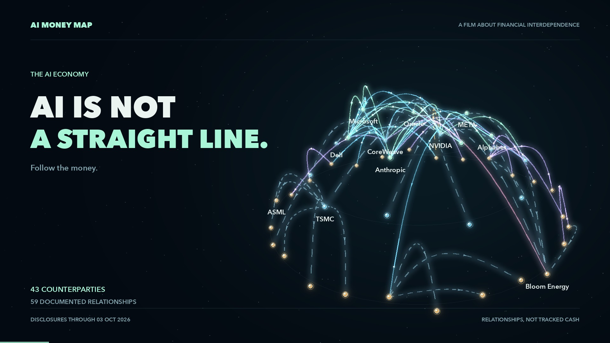

# Follow the Money · AI Money Map

Explore where AI spending goes, who earns it, and which companies could benefit under three alternative futures through 2030.

An interactive research app with a **162-entity directory**, including **132 public issuers** and **100 saved financial profiles**, across the global AI supply chain, from platforms and chips to power, cooling and construction. **32 public issuers still await financial profiles.** Created by **Heikki Hämäläinen with Astra Ultra**.

[](https://github.com/hehamalainen/followthemoney/raw/refs/heads/main/dist/media/ai-money-map-30s-wide.mp4)

**[Download widescreen film](https://github.com/hehamalainen/followthemoney/raw/refs/heads/main/dist/media/ai-money-map-30s-wide.mp4)** · **[Download vertical film](https://github.com/hehamalainen/followthemoney/raw/refs/heads/main/dist/media/ai-money-map-30s-vertical.mp4)** · **[Example circulation PDF](dist/reports/circulation-snapshot.pdf)**

## Run locally

Requires Python 3 to serve the files. No build step, API key, account or package installation is needed to use the app.

```sh
git clone https://github.com/hehamalainen/followthemoney.git
cd followthemoney
python3 -m http.server 4173 --bind 127.0.0.1 --directory dist
```

Open **http://127.0.0.1:4173/**. Serve the folder over HTTP; opening `index.html` directly prevents browsers from loading its JSON datasets.

## Explore

| View | What it shows |
| --- | --- |
| **Universe** | An animated spatial money-flow map with orbit, zoom, company search and a guided journey. |
| **Company directory** | 162 entities, including 132 public issuers, with aliases, parent identities, listing status and explicit research gaps. |
| **Money circulation** | 57 counterparties, 84 sourced relationships and 17 cases across model/cloud partnerships, compute suppliers and physical infrastructure. |
| **Supply chain** | 100 selected public companies across nine sectors, including suppliers beyond the largest technology names. |
| **Profit & cash** | Reported company net income and free cash flow, with reporting periods, currencies and source links. |
| **Hidden champions** | A transparent screen combining business position, financial results and relative stock performance. |
| **2030 scenarios** | Three authored futures, 300 company ratings, mechanisms, counterarguments and evidence to monitor. |
| **Valuation & debt** | Dated equity values, P/E, FCF yield, borrowing, cash and matched-date net debt where verified. |
| **PDF reports** | Generate circulation, valuation, scenario, company and full-research reports in the browser. |
| **Film** | Original 30-second widescreen and vertical films with an original synthesized instrumental score, captions and transcript. |

The Universe's fourth dimension is **illustrative scenario time**. Financial figures remain fixed at the saved snapshot. Node size, link width, positions and moving particles do not encode cash amounts or settlement.

## A dated, inspectable research snapshot

**Research date: 3 October 2026. Market closes: 2 October 2026.** There is no automatic refresh. This is a selected universe, not a list of the 100 largest companies. The coverage audit reviewed on 4 October uses that same evidence cutoff; it expands identities and relationships without refreshing the 100-company financial, stock, valuation or scenario snapshot.

Financials describe the whole company, not AI-only earnings. Missing values are not zero. Scenarios and rankings are authored judgments, not forecasts, probabilities or projected stock returns. “Hidden champion” means a company passes the documented screen; it does not establish fair value or investor awareness.

Circulation distinguishes investments, commitments, recognized revenue, guarantees, facilities, supplier relationships and non-cash incentives. It does not add them into a circular-dollar total or claim to trace the same cash through multiple companies. Private model labs, subsidiaries, projects and financing groups appear alongside public issuers in the directory; directory membership does not imply a financial profile or a separate stock. Aliases resolve products and former names to their issuer, while parent links keep subsidiaries distinct from listed parents.

The committed films remain the original dated **43-counterparty / 59-relationship** edition; the coverage expansion does not alter their media. See **[Coverage audit and the 32 financial gaps](docs/COVERAGE_AUDIT.md)** for additions and identity corrections.

Read **[Data and methodology](docs/DATA.md)** for selection rules, valuation coverage, source provenance and updating. This project is a research tool, not investment advice.

## Project structure

```text
dist/                     Complete static app; deploy this folder
  data.json               Company financials and stock comparisons
  scenarios.json          Authored assumptions and company assessments
  circulation.json        Sourced counterparties, relationships and cases
  coverage.json           Entity directory, aliases, identities and coverage gaps
  valuation.json          Normalized valuation and debt snapshot
  media/                  Films, posters and English captions
  vendor/                 Local PDF library and its license
scripts/                  Dataset builders, fetchers and checks
  research/               Saved research inputs and provenance
  film/                   Motion-graphics renderer and music composer
docs/                     Methodology and maintenance notes
```

Plain HTML, CSS, JavaScript and Canvas power the app. Code, datasets, films and PDF tooling are served from this repository. The interface optionally loads DM Sans and Manrope from Google Fonts, with system-font fallbacks when offline. Browser PDF generation uses the vendored `pdf-lib` library. No backend or external runtime data service is required.

## Check changes

Use Python **3.12+** and Node.js **22+** for development checks:

```sh
python3 scripts/check.py
```

This validates data, valuation and directory invariants, exercises the hidden-candidate screen and Universe logic, checks JavaScript syntax and generates all five PDF report types in a temporary directory. PDF layout changes also need visual review.

To verify both committed films, install FFmpeg (including `ffprobe`), then run:

```sh
python3 scripts/film/verify.py
```

GitHub Actions runs these checks and verifies that the saved circulation, directory, scenarios and normalized valuation rebuild without changes. It does not fetch live financial data.

## Rebuild data or films

The committed datasets are enough to run the app. Rebuilding the financial snapshot requires additional cached SEC inputs; incomplete inputs stop the builders before they replace the saved output. See **[Data and methodology](docs/DATA.md)**.

Rebuild the relationship map before the directory that incorporates it:

```sh
python3 scripts/build_circulation.py
python3 scripts/build_coverage.py
```

These two builders use committed research inputs and make no network requests. They do not add financial profiles or scenario ratings for the 32 public coverage gaps.

The optional film tools require **NumPy, Pillow, FFmpeg and fonts**:

```sh
python3 -m venv .venv
# Activate the environment using the command for your shell.
.venv/bin/python -m pip install -r scripts/film/requirements.txt
.venv/bin/python scripts/film/compose.py
.venv/bin/python scripts/film/render.py \
  --output dist/media/ai-money-map-30s-wide.mp4 \
  --audio scripts/film/score.wav \
  --site-url https://github.com/hehamalainen/followthemoney
```

On Windows, use `.venv\Scripts\python.exe`. Add `--vertical` and use the vertical output filename for the portrait edition. Use `--help` for font overrides and still-image rendering. Rendering replaces the specified output. Fonts are supplied by your machine, not bundled with this project; exact typography depends on the selected fonts.

The score is composed and synthesized in code: no sampled songs, recordings or soundfonts. Films are 30 seconds, 30 fps, H.264/AAC stereo, at 1920×1080 and 1080×1920. The committed films retain the original project's closing website address; `--site-url` customizes future renders.

## Host your own copy

Upload the **contents of `dist/`** to any static host. Keep the JSON files, `media/`, `reports/` and `vendor/` alongside the application files. Relative asset paths support deployment under a subdirectory. The existing hosted edition has its own access settings; cloning this public repository gives you an independently runnable copy.

## Contribute and reuse

Bug fixes, accessibility improvements and sourced research corrections are welcome. See **[Contributing](CONTRIBUTING.md)**.

Original project code, documentation and original media are released under the **[MIT License](LICENSE)**. Preserve the included third-party license notices. Financial facts, provider datasets, linked publications, trademarks and local fonts have separate provenance and rights; see **[Third-party notices](THIRD_PARTY_NOTICES.md)**.
